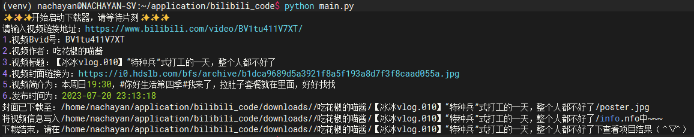
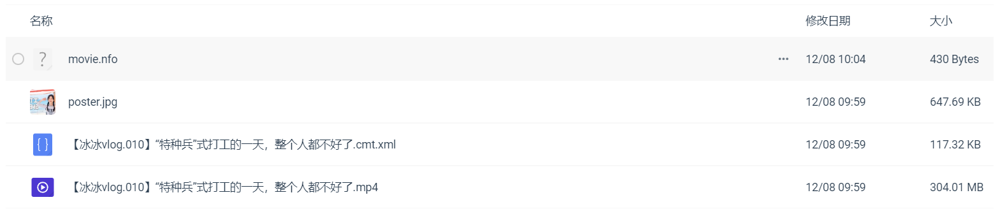

# BiliBili视频下载器

## 研发阶段 
- 开发语言：Python
- 开发工具：PyCharm
- 开发环境：Windows 11

**项目启动：2023年08月11日** 

简单使用you-get库加cookies实现下载B站视频并将视频信息整理为适合Jellyfin、Emby的文件夹格式，打造更方便的海报墙的方法。

**操作**

克隆本项目后，进入项目目录
```
cd bilibili_code
```

建议在虚拟环境下下载所需依赖
```
pip install -r requirements.txt
```
接下来便可以直接执行主文件 main.py
```
python main.py
```
等待弹出输入链接的字样后，输入B站视频链接，等待下载完成即可





**TODO:** 

1. [ ] 建立可选配置的模式
2. [ ] 将手动设置个人cookies的方式升级为通过api获取
3. [ ] another